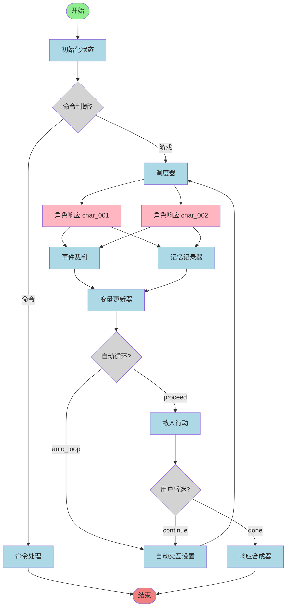

# RPG Game Engine — LangGraph 版本 v2

> **⚠️ 注意：本项目为 Gemini 驱动的初版实现，功能完整但未经充分测试，请在开发环境中使用。**

基于 [LangGraph](https://github.com/langchain-ai/langgraph) 构建的多角色 RPG 游戏引擎，支持并行角色响应、事件裁判、记忆记录和敌人策略等功能。

## 架构图




## 工作流程

| 阶段 | 节点 | 说明 |
|------|------|------|
| 初始化 | `init_state` | 初始化游戏状态 |
| 路由 | `is_command` | 判断输入是命令还是游戏对话 |
| 调度 | `dispatcher` | 决定哪些角色参与本轮，过滤各角色上下文 |
| 角色响应 | `char_respond_*` | 各角色并行生成响应 |
| 并行处理 | `event_judge` + `memory_recorder` | 裁判变量变化 + 更新记忆摘要 |
| 变量更新 | `variable_updater` | 应用所有变量变化 |
| 敌人行动 | `enemy_action` | 敌对角色消耗气运值触发事件 |
| 自动交互 | `auto_interact_setup` | 用户昏迷时角色自动互动（最多10轮） |
| 合成响应 | `response_composer` | 生成最终叙事文本 |

## 快速开始

### 1. 安装依赖

```bash
pip install -e . "langgraph-cli[inmem]"
```

### 2. 配置环境变量

```bash
cp .env.example .env
```

编辑 `.env`：

```env
OPENAI_BASE_URL=https://your-proxy.com/v1   # LLM 中转地址
OPENAI_API_KEY=sk-...                        # API 密钥
LANGSMITH_API_KEY=lsv2...                    # 可选，用于追踪
```

### 3. 启动服务

```bash
langgraph dev
```

浏览器访问 `http://localhost:2024` 打开 LangGraph Studio。

## 自定义配置

所有配置集中在 [`src/agent/config.py`](src/agent/config.py)。

### 添加/修改角色

```python
CHARACTER_CARDS: dict[str, str] = {
    "char_001": """
【角色卡：角色名】
名字：...
性格：...
背景：...
""",
}

CHARACTER_INIT_VARS: dict[str, dict] = {
    "char_001": {
        "affection": 50,       # 好感度 0-100
        "luck": 100,           # 气运值 0-1000
        "is_hostile": False,   # 是否敌对
        ...
    },
}
```

### 配置模型

每个角色和组件可以独立指定模型和中转服务：

```python
CHARACTER_MODELS = {
    "char_001": _m("gpt-4o-mini", temperature=0.8),
    "char_002": _m("gpt-4o-mini", temperature=0.7,
                   base_url="https://other-proxy.com/v1",
                   api_key="sk-other"),
}

COMPONENT_MODELS = {
    "dispatcher":        _m("gpt-4o-mini", temperature=0.3),
    "response_composer": _m("gpt-4o",      temperature=0.9),
    ...
}
```

支持的 `provider`：`openai`（含所有兼容中转）、`anthropic`、`ollama`。

### 游戏参数

```python
MAX_AUTO_INTERACT_TURNS = 10     # 昏迷时最大自动交互轮次
ENEMY_ACTION_LUCK_THRESHOLD = 500  # 触发敌人行动的最低气运值
ENEMY_ACTION_TURN_COOLDOWN = 5   # 敌人行动冷却轮次
```

## 项目结构

```
src/agent/
├── config.py   # 角色卡、模型配置、Prompt 模板
├── state.py    # GameState 状态定义
├── nodes.py    # 所有节点函数
├── tools.py    # 存档/读档工具
└── graph.py    # 图结构定义（入口）
```

## 可视化结构图

运行 [`langgraph_visualization.ipynb`](langgraph_visualization.ipynb) 可生成交互式结构图（需要安装 `graphviz`）：

```bash
pip install graphviz
jupyter notebook langgraph_visualization.ipynb
```

## 技术栈

- [LangGraph](https://github.com/langchain-ai/langgraph) — 状态机与流程管理
- [LangChain](https://github.com/langchain-ai/langchain) — LLM 调用
- 支持 OpenAI / Anthropic / Ollama 及任意兼容中转

---

*初版由 Gemini 驱动生成，未经充分测试。欢迎提交 Issue 和 PR。*
